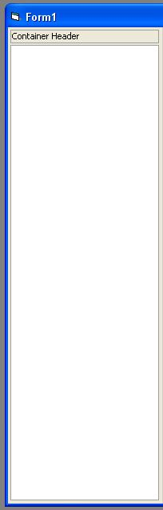



## Container Control

### Description

MY VERY FIRST ACTIVEX CONTROL so please go easy on me! Its just a SIMPLE container that looks nice. I just decided to do this because i wanted something that i could use over and over again. Ability to change the font, font colour, border colours (header and the main border) and background colours. Still not 100% finished, plenty more to go in, any feedback will be appreciated.
 
### More Info
 

             |
---                |---
**Submitted On**   |2003-04-24 10:38:02
**By**             |[Wayne Boyles](https://github.com/Planet-Source-Code/PSCIndex/blob/master/ByAuthor/wayne-boyles.md)
**Level**          |Beginner
**User Rating**    |5.0 (10 globes from 2 users)
**Compatibility**  |VB 5\.0, VB 6\.0
**Category**       |[Custom Controls/ Forms/  Menus](https://github.com/Planet-Source-Code/PSCIndex/blob/master/ByCategory/custom-controls-forms-menus__1-4.md)
**World**          |[Visual Basic](https://github.com/Planet-Source-Code/PSCIndex/blob/master/ByWorld/visual-basic.md)
**Archive File**   |[Container\_1578774242003\.zip](https://github.com/Planet-Source-Code/wayne-boyles-container-control__1-45000/archive/master.zip)

